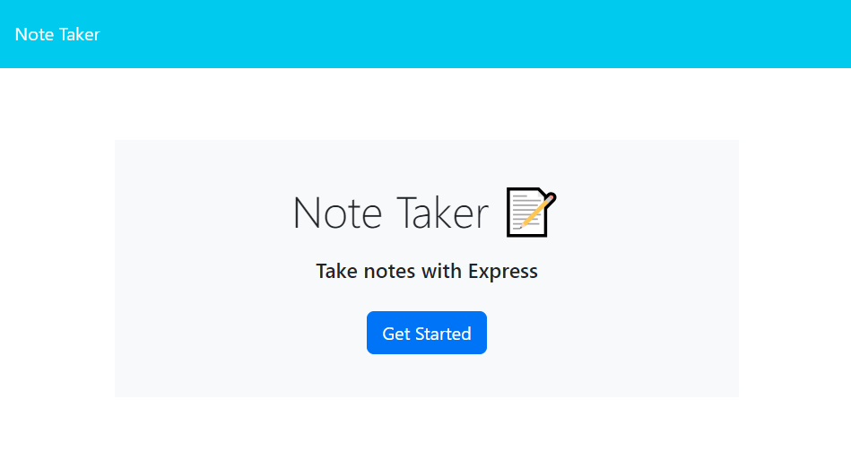
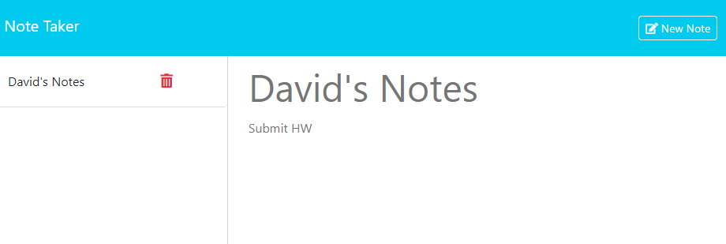
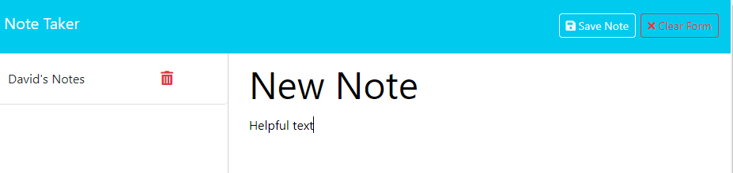

# Note-Taker

## Description
In this assignment I used modified starter code to create an application that can write and save notes. The purpose of this application is to help the user to be organized and be a more successful worker, and this note taking application can helps keep someone be on top of their work. The goal of this assignment is to highlight the use of: middleware, routes and Express.js. This application was deployed through the use heroku.

## Technologies Used
* Express.js 
* JSON
* Node.js
* JavaScript
* uuid package
* nodemon package

## Installation

[Deployed link](https://dnc-notetaker-b54a86a6e4be.herokuapp.com/)

* To install go to your command line and enter the following: 
* Clone the repo.
* Run "npm i" in the command line.
* Start the server ny entering in the command line "node server"

## Usage

## Contact Information
<a href="https://github.com/caldardn/Note-Taker">Github Repo</a>

[Contact me](caldardn@gmail.com)